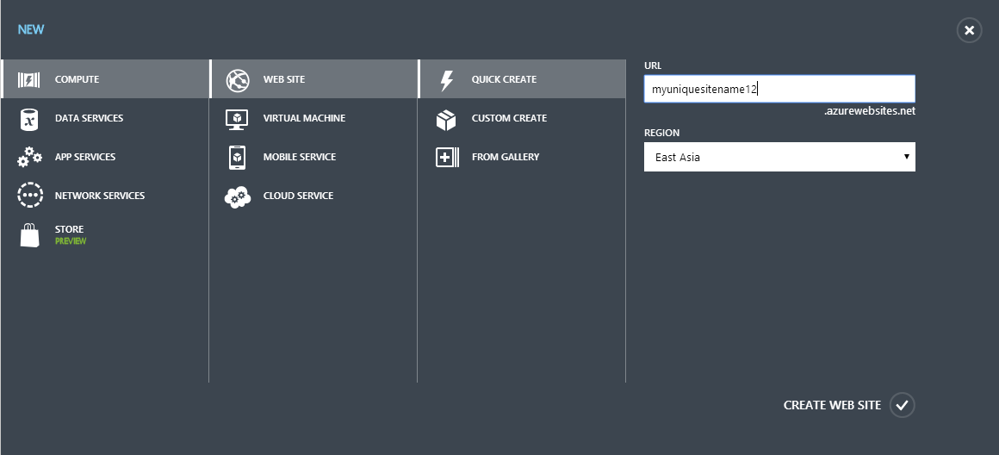
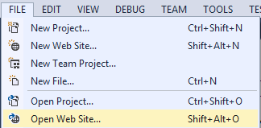
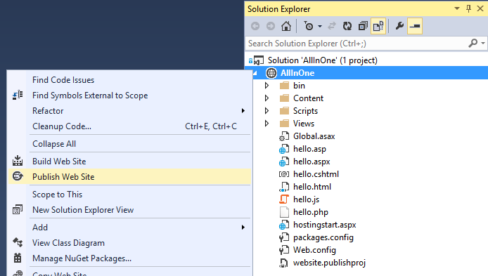
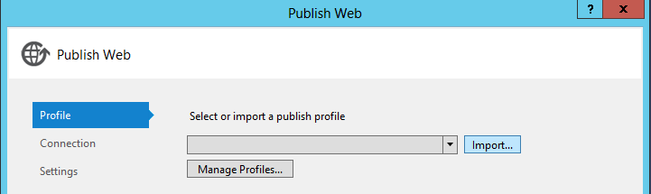
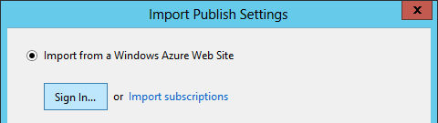
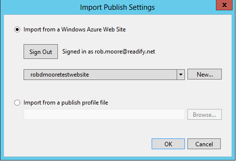

Deploying a Windows Azure Web Site
==================================

This is a hands-on lab for deploying a Windows Azure Web Site for Global Windows Azure Bootcamp Perth 2014. We are going to be deploying the [AllInOne](https://github.com/WindowsAzure-Samples/AllInOne) example code to a Windows Azure Web Site that we create. This demonstrates how easy and quick it is to get up and running with a Web Site in Azure that can run (out-of-the-box):

* ASP.NET (e.g. MVC, WebAPI, Web Forms, Web Pages)
* Classic ASP
* PHP
* nodeJS

1. Log into the [Windows Azure Management Portal](http://manage.windowsazure.com)
2. Click on `New` on the bottom right and select `Compute` > `Web Site` > `Quick Create`
    * Enter a unique name for your site in the `URL` field
    * Select a Region to deploy to in the `Region` field
    
3. Download the [AllInOne zip file](AllInOne.zip) and unzip it on your computer
4. Open Visual Studio and from the `File` menu choose `Open a New Website` and navigate to and select the `AllInOne` folder that you unzipped
    
5. Right cick the site and Select `Publish Web Site`
    
6. Select the `Import Profile` button
    
7. If you haven't already then `Sign In` with your Windows Azure Microsoft account
    
8. Once signed in select the site to deploy to as the one you created in step 2
    

If you are a superstar and you finished the hands-on lab early or you are revisiting this lab after the fact there are some more labs we've included for you below that cover some of the other concepts/options around creating and deploying Windows Azure Web Sites. Feel free to pick any of them that interest you.

Further reading:

* [How to Deploy a Windows Azure Web Site](http://www.windowsazure.com/en-us/documentation/articles/web-sites-deploy/)
* [How to configure Web Sites](http://www.windowsazure.com/en-us/documentation/articles/web-sites-configure/)

Advanced: Create a continuous integration and deployment pipeline using Visual Studio Online
--------------------------------------------------------------------------------------------

There are a bunch of options when it comes to using Windows Azure Web Sites with continuous integration and as part of automated deployment pipelines. There is an out-of-the-box experience with the recently launched Visual Studio Online (previously called Team Foundation Service) where in a few clicks you can create a continuous integration build that compiles your code and runs your tests and then if the tests pass triggers a deployment to Azure. The out-of-the-box experience will only work if you have a fairly basic project and we would expect a different setup for serious production websites, but it's a great example of the power of the Windows Azure platform so we've included it as a lab for you.

1. This tutorial is pretty good (barring a few spelling mistakes here and there: [http://irisclasson.com/2014/01/11/visual-studio-online-setup-speed-test-and-guide-continuous-integration-and-deployment-pipeline/](http://irisclasson.com/2014/01/11/visual-studio-online-setup-speed-test-and-guide-continuous-integration-and-deployment-pipeline/)

Advanced: Create a site using the command-line tools
----------------------------------------------------
The documentation for the command-line tools is at [http://www.windowsazure.com/en-us/documentation/articles/xplat-cli/](http://www.windowsazure.com/en-us/documentation/articles/xplat-cli/) - feel free to read it to get more detailed explanations of any of the steps below. See also this *awesome* post by [Scott Hanselman](http://www.hanselman.com/blog/ManagingTheCloudFromTheCommandLine.aspx).

1. Download and install the [Windows Azure command-line tools for Windows](http://go.microsoft.com/?linkid=9828653&clcid=0x409) (found via the [Windows Azure downloads page](http://www.windowsazure.com/en-us/downloads/)).
2. Open a new command window and execute `azure` to see an overview of the commands you can run
    * If it complains that it can't find `azure` then your `PATH` variable wasn't updated and you need to open `Windows Explorer` right-click on `Computer` and select `Properties` and then click on the `Environment Variables` button and click `OK` and `OK` again.
3. Download your `.publishsettings` file that contains the credentials for your Windows Azure account to perform API requests by executing `azure account download` in the command line, which will open a browser window and require you to log into your  Azure account
4. Find the location of the downloaded `.publishsettings` file
5. Import the `.publishsettings` file into the Azure commandline by using `azure account import {path to .publishsettings file}`
    * Delete the downloaded `.publishsettings` file
    * If you have production instances on your subscription then read the documentation to find out where it stores the settings and how to encrypt the directory it's in
6. Find out all the locations that you can deploy to with `azure site location list`
7. Create a new website using `azure site create "<your_unique_site_name>" --location "A Valid Location"`
    * You can also leave out the `--location` option and it will prompt you for the location to deploy to
8. View the site status using `azure site list` or by looking in the portal at your Web Sites
9. The command-line tools are very discoverable - you can navigate the possible list of commands by executing `azure` and seeing the list of command categories and then `azure [category]` to see the list of commands for a given category then to see the options for a particular command execute `azure [category] [command] -h`
    * Feel free to play around and see all of the options that are available to you

Advanced: Use git for publishing
----------------------------------
This requires you to have Git set up on your machine and to have done steps 1-5 of the "Create a site using the command-line tools" lab above. 

1. Go to the Dashboard of a Web Site in the Windows Azure portal
2. Click on the `Reset your deployment credentials link` and create some credentials
    * These credentials are used for FTP and Git
    * Make sure you remember the password as you will need it later
3.  Pull up the command-line and in a new directory somewhere execute `azure site create "<your_unique_site_name>" --location "A Valid Location" --git`
    * This will create a site and set up a git checkout in the current directory with a remote called `azure` that allows you to push from the current checkout to your azure site
    * If you are feeling particularly adventurous then type in `azure site create -h` and use the GitHub options instead to link the site to a GitHub repository
        * Leave out the password option to make it prompt you so you don't have to type it in clear text
4. Put some files in the repository that has been created and commit them then do an `git push azure` to deploy the changes to Azure
    * It will prompt you for the deployment credential password you set up in step 2
    * If you connected GitHub then you will need to push the changes to your GitHub repository and it will automatically deploy
5. To navigate to your site execute `azure site browser "<your_site_name>"`
