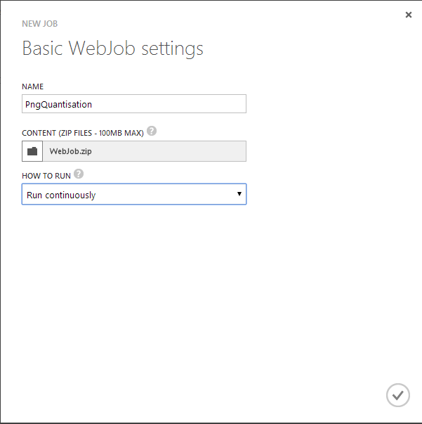
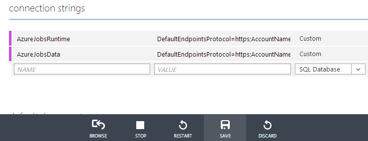
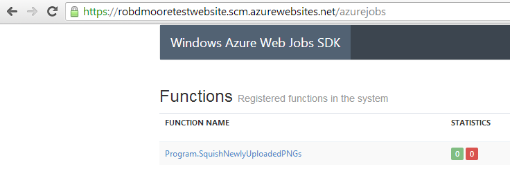

SQL Database and Cache
======================

This is a hands-on lab for using Azure SQL Database and Cache.

If you finish early then check out the advanced lab below.

Advanced: Create Web Job to do PNG Quantization
-----------------------------------------------

This is based on the [blog post by Scott Hanselman](http://www.hanselman.com/blog/IntroducingWindowsAzureWebJobs.aspx). See also the [Getting Started with the Web Jobs SDK](http://www.asp.net/aspnet/overview/developing-apps-with-windows-azure/getting-started-with-windows-azure-webjobs) post.

1. Create a new console application in Visual Studio
2. Add a reference to `System.Drawing 4.0.0.0`
3. `Install-Package nquant`
4. `Install-Package Microsoft.WindowsAzure.Jobs.Host -pre`
5. Change `Program.cs` to include this:
    ```c#
    using Microsoft.WindowsAzure.Jobs;
    using nQuant;
    using System.Drawing;
    using System.Drawing.Imaging;
    using System.IO;

    namespace ConsoleApplication1
    {
        class Program
        {
            static void Main(string[] args)
            {
                JobHost host = new JobHost();
                host.RunAndBlock();
            }

            public static void SquishNewlyUploadedPNGs(
                [BlobInput("input/{name}")] Stream input,
                [BlobOutput("output/{name}")] Stream output)
            {
                var quantizer = new WuQuantizer();
                using (var bitmap = new Bitmap(input))
                {
                    using (var quantized = quantizer.QuantizeImage(bitmap))
                    {
                        quantized.Save(output, ImageFormat.Png);
                    }
                }

            }
        }
    }
    ```
6. Build the solution
7. Go to `bin\Debug` and zip up all the files up
8. Go to the WebJobs tab for a Web Site in the Windows Azure portal
9. Click `New` to create a new web job by uploading the zip file
    
10. [Create a Windows Azure Storage Account](http://www.windowsazure.com/en-us/documentation/articles/storage-create-storage-account/) if you haven't already
11. Construct a connection string for your storage account
    * `DefaultEndpointsProtocol=https;AccountName=<storage_account_name>;AccountKey=<storage_account_access_key>`
12. Go to the `Configure` tab for your Web Site in the Windows Azure portal and add the storage account connection string for the `AzureJobsRuntime` and `AzureJobsData` connection strings
    
13. Look at the status of the web job in the WebJobs tab of your Web Site and ensure it's set to Running
    
14. Look at the logs and dashboard for your Web Job to monitor what happens when it's invoked
    * [https://<site>.scm.azurewebsites.net/vfs/data/jobs/continuous/PngQuantisation/job_log.txt](https://<site>.scm.azurewebsites.net/vfs/data/jobs/continuous/PngQuantisation/job_log.txt)
    * [https://<site>.scm.azurewebsites.net/azurejobs/](https://<site>.scm.azurewebsites.net/azurejobs/)
15. Open up the storage account that you are using for the web job inside of Visual Studio `View > Server Explorer > Windows Azure > Storage` (or any other tool of choice)
16. Drop in [sample.png](https://github.com/MRCollective/WindowsAzureBootcampPerth2014/raw/master/6_SQLDatabaseAndCache/sample.png) to the input blob container
17. Wait for the file to get processed into the output directory
    * It should be smaller and the Web Jobs dashboard and log should show that it successfully processed

